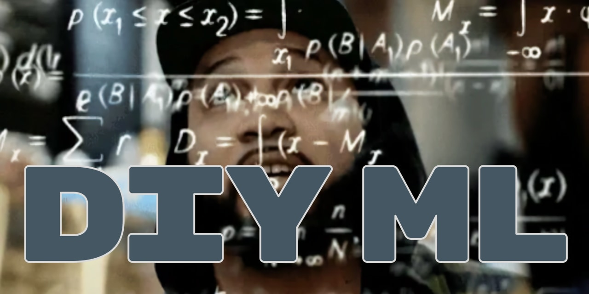

# DIY Machine Learning 🧑‍💻

_toy implementations of common machine learning concepts_

I get inspired from time to time to build the tools I use from scratch. I have been building ML algos for a couple years but have not yet built all the underlying machinery.

This repo uses numpy and matplotlib, but will try to use plain old python for everything else.

Techniques:

1. [clustering/](Clustering)
1. [classification/](Classification)
1. [nn/](Neural Networks)
