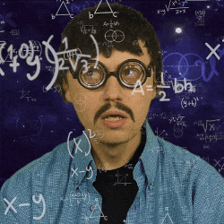
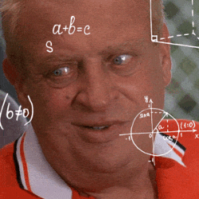

# DIY Machine Learning 🧑‍💻

_toy implementations of common machine learning concepts_

I get inspired from time to time to build the tools I use from scratch. I have been building NNs for a couple years but have not yet built all the underlying machinery.

I also get inspired to talk about the different things I've learned. This project will be home to simple implementations of concepts that come up in conversation with people curious about how it all works, so they can gets hands-on after we talk.

